# Oliver Kell「价格行为周期」内容与图片整理

> 来源：[Cycle Of Price Action | TraderLion](https://traderlion.com/technical-analysis/chart-patterns/cycle-of-price-action-by-oliver-kell/)  
> 作者：Oliver Kell  
> 发布日期：2024-09-10  
> 说明：本文是对原文的内容整理与图片索引，不构成投资建议。

## 核心摘要

Oliver Kell 是 2020 年 U.S. Investing Championship 冠军，当年收益率为 941%。文章介绍的「Cycle of Price Action」是一套以价格行为为核心的周期框架，不依赖新闻、财报解读或传闻，而是通过价格、成交量、移动平均线和多时间周期来识别积累、趋势、派发与反转。

该框架的关键是判断当前价格处于周期中的哪一阶段：

1. 恐慌性卖压后形成潜在底部。
2. 价格重新回到移动平均线上方，出现低风险入场点。
3. 趋势延续阶段反复整理、突破，可以逐步加仓。
4. 价格过度扩张、成交量出现异常后进入派发或顶部。
5. 跌破移动平均线后确认下跌趋势。
6. 下跌趋势中反弹受制于移动平均线，最终再次出现恐慌底，周期重启。

## 价格周期总览

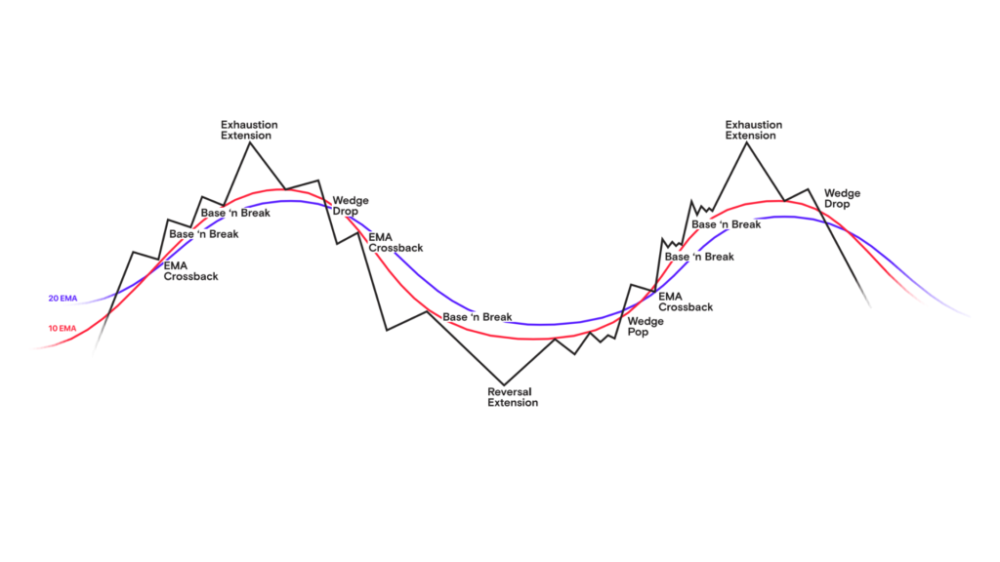  
图 1：价格行为周期图。原始图片：[Cycle-of-Price-Oliver-Kell.png](https://traderlionmedia.s3.us-east-2.amazonaws.com/wp-content/uploads/2024/09/04133730/Cycle-of-Price-Oliver-Kell.png)

文章将价格周期分为上涨段与下跌段：

- **上涨段**：Reversal Extension → Wedge Pop → EMA Crossback → Base n' Break → Exhaustion Extension。
- **下跌段**：Wedge Drop → EMA Crossback Downside → Base n' Break Downside，最终再次进入 Reversal Extension。
- **核心观察对象**：价格与移动平均线的位置关系、成交量是否确认突破或反转、高低时间周期是否一致。

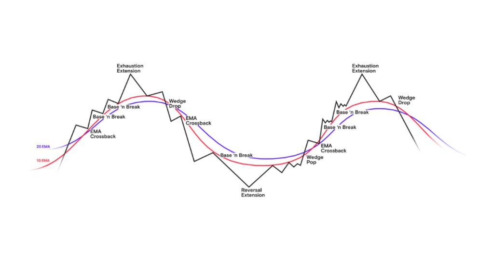  
图 2：文章主图。原始图片：[Oliver-Kell-Cycle-of-Price-Action-Feature-1024x576.png](https://traderlionmedia.s3.us-east-2.amazonaws.com/wp-content/uploads/2024/09/04134038/Oliver-Kell-Cycle-of-Price-Action-Feature-1024x576.png)

## 上涨段关键信号

### 1. Reversal Extension：潜在反转起点

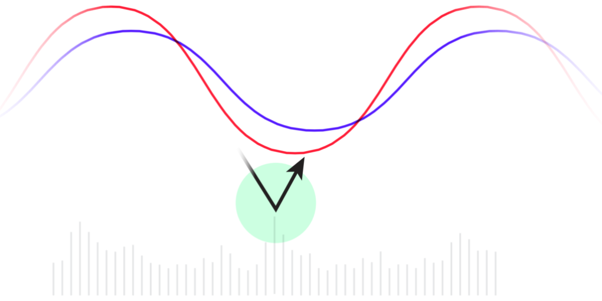  
图 3：Reversal Extension 概念图。原始图片：[VIST-Reversal-Extension-2-1024x512-1-1020x510.png](https://traderlionmedia.s3.us-east-2.amazonaws.com/wp-content/uploads/2024/09/11012052/VIST-Reversal-Extension-2-1024x512-1-1020x510.png)

Reversal Extension 出现在价格周期底部，通常表现为恐惧驱动下的最终抛售。投资者无法继续承受亏损，被迫卖出。此时需要通过高时间周期寻找明确支撑，同时观察低时间周期价格过度下跌后快速回到移动平均线附近。大量成交是这个阶段的重要确认信号。

| 示例 | 内容 |
| --- | --- |
| 股票代码 | ELF |
| 公司 | e.l.f. Beauty |
| 年份 | 2023 |

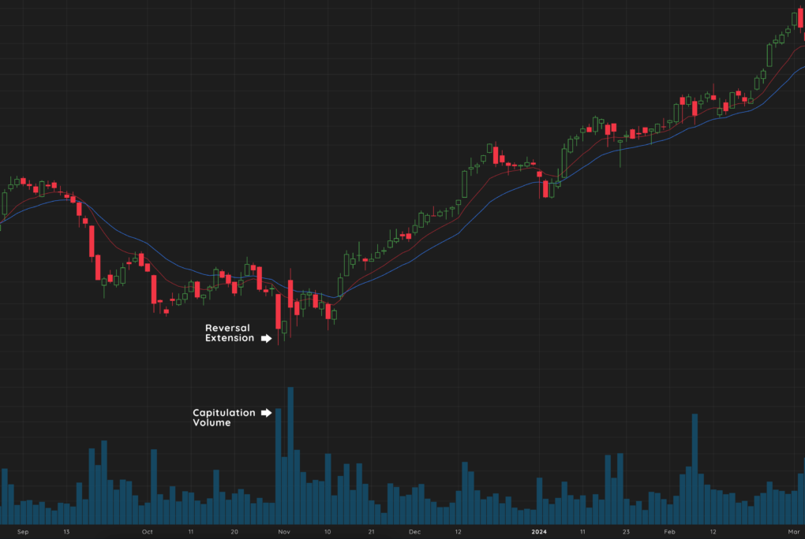  
图 4：ELF 的 Reversal Extension 示例。图表来源：Deepvue。原始图片：[Cycle-Of-Price-Action_2.png](https://traderlionmedia.s3.us-east-2.amazonaws.com/wp-content/uploads/2024/09/11013308/Cycle-Of-Price-Action_2.png)

### 2. Wedge Pop：趋势启动的第一个关键买点

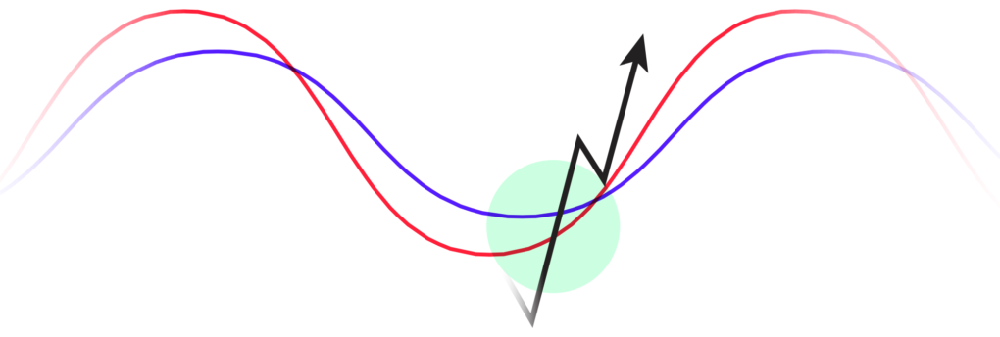  
图 5：Wedge Pop 概念图。原始图片：[VIST-Wedge-Pop-1-1020x344.png](https://traderlionmedia.s3.us-east-2.amazonaws.com/wp-content/uploads/2024/09/11013448/VIST-Wedge-Pop-1-1020x344.png)

Wedge Pop 是价格从底部反弹后第一次重新站上移动平均线的位置。价格通常会先横向或小幅回落，这一阶段可以观察相对强弱。当价格和移动平均线收紧、形成枢轴点，并突破短期阻力时，就出现风险较清晰的入场点。

| 示例 | 内容 |
| --- | --- |
| 股票代码 | NVDA |
| 公司 | NVIDIA |
| 年份 | 2023 |

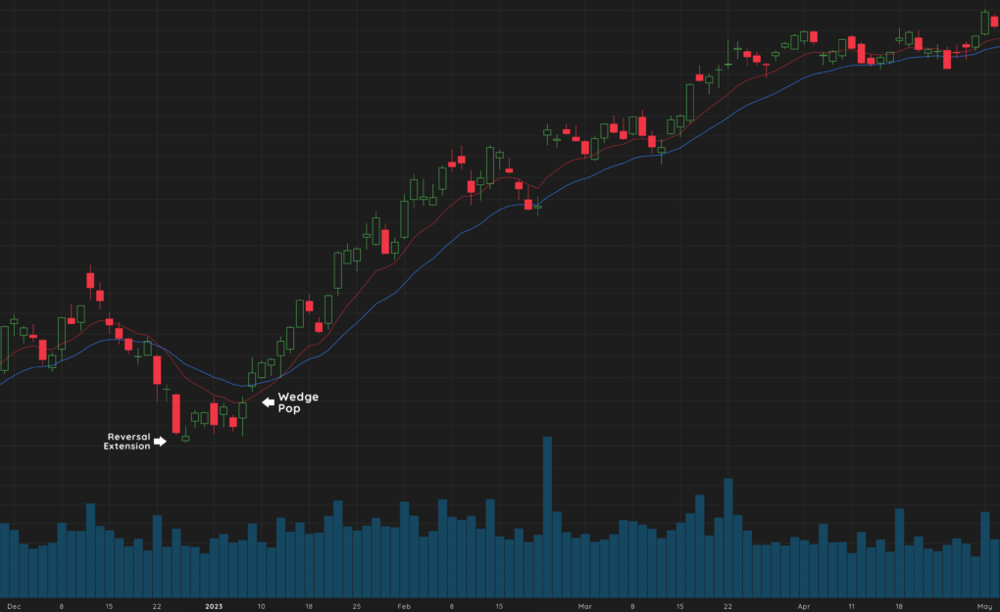  
图 6：NVDA 的 Wedge Pop 示例。图表来源：Deepvue。原始图片：[Cycle-Of-Price-Action_3.png](https://traderlionmedia.s3.us-east-2.amazonaws.com/wp-content/uploads/2024/09/11013553/Cycle-Of-Price-Action_3.png)

### 3. EMA Crossback：第二次入场机会

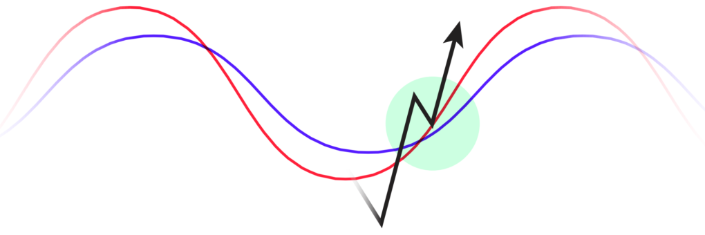  
图 7：EMA Crossback 概念图。原始图片：[VIST-EMA-Crossback-1-1020x340.png](https://traderlionmedia.s3.us-east-2.amazonaws.com/wp-content/uploads/2024/09/11013806/VIST-EMA-Crossback-1-1020x340.png)

Wedge Pop 之后，价格常再次回测移动平均线，称为 EMA Crossback。此时价格在移动平均线附近整理，等待买盘重新出现。这个阶段可以在趋势早期继续建立或增加仓位，以获得更长的持仓空间。

| 示例 | 内容 |
| --- | --- |
| 股票代码 | TOL |
| 公司 | Toll Brothers |
| 年份 | 2023 |

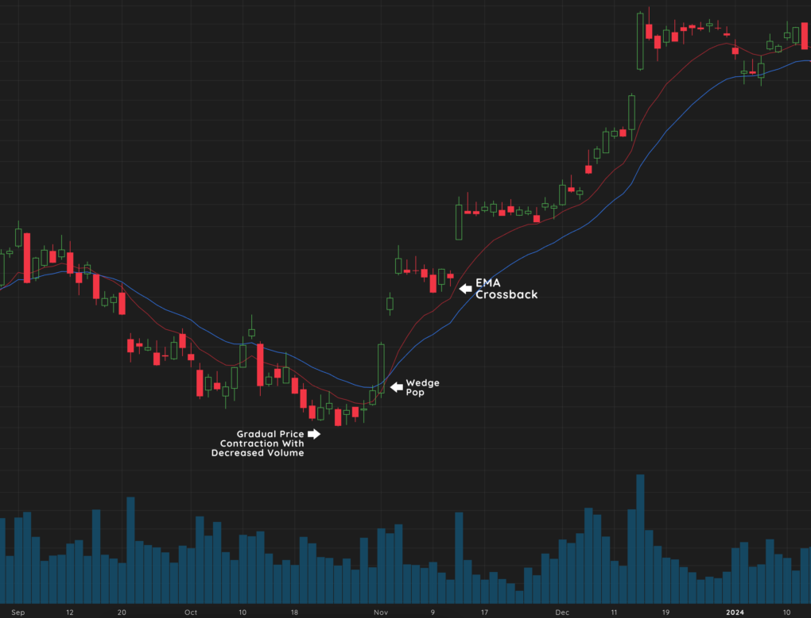  
图 8：TOL 的 EMA Crossback 示例。图表来源：Deepvue。原始图片：[Cycle-Of-Price-Action_4.png](https://traderlionmedia.s3.us-east-2.amazonaws.com/wp-content/uploads/2024/09/11013838/Cycle-Of-Price-Action_4.png)

### 4. Base n' Break：趋势延续与突破

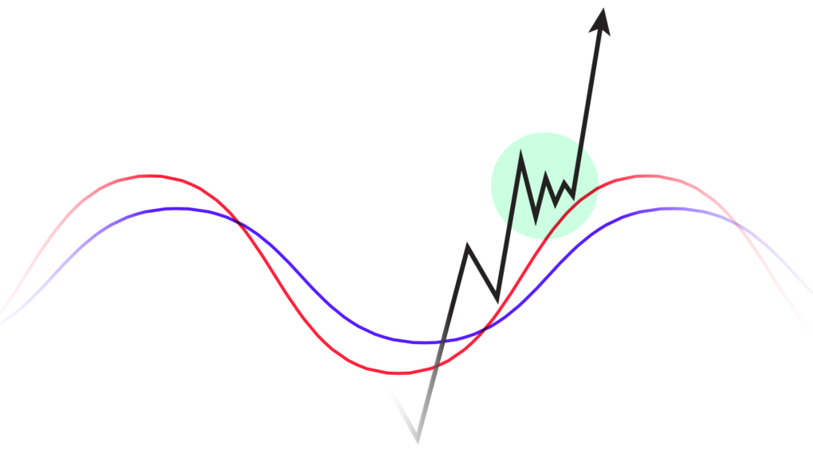  
图 9：Base n' Break 概念图。原始图片：[VIST-Base-n-Break-1-1020x569.png](https://traderlionmedia.s3.us-east-2.amazonaws.com/wp-content/uploads/2024/09/11013902/VIST-Base-n-Break-1-1020x569.png)

价格开始横向整理，让移动平均线追上价格。这种紧凑的筑底结构通常在几周内形成，并且可能在趋势中反复出现。Base n' Break 可以出现在更大级别底部内部、高级别突破附近，或紧凑旗形之后。移动平均线继续提供支撑，更高的低点则有助于用移动止损保护利润。

| 示例 | 内容 |
| --- | --- |
| 股票代码 | WING |
| 公司 | Wingstop |
| 年份 | 2023 |

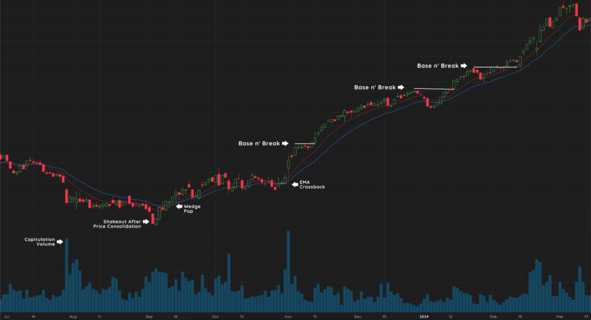  
图 10：WING 的 Base n' Break 示例。图表来源：Deepvue。原始图片：[Cycle-Of-Price-Action_5-1.png](https://traderlionmedia.s3.us-east-2.amazonaws.com/wp-content/uploads/2024/09/11014041/Cycle-Of-Price-Action_5-1.png)

### 5. Exhaustion Extension：上涨趋势接近尾声

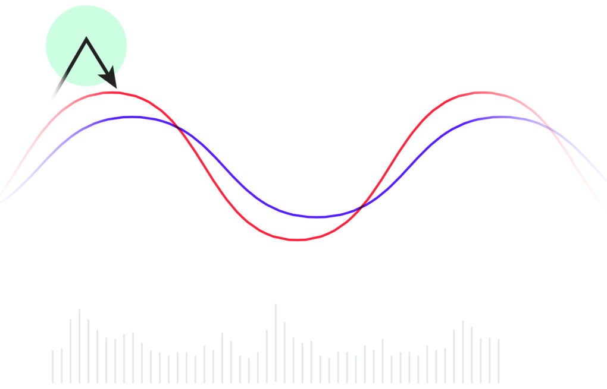  
图 11：Exhaustion Extension 概念图。原始图片：[VIST-Exhaustion-Extension-1-1020x655.png](https://traderlionmedia.s3.us-east-2.amazonaws.com/wp-content/uploads/2024/09/11014600/VIST-Exhaustion-Extension-1-1020x655.png)

Exhaustion Extension 是上涨趋势末端的过度扩张信号。价格明显脱离移动平均线，表现出情绪化的 blowoff 行为。高时间周期与低时间周期同时远离均线时，说明趋势可能已经透支。随后价格反转，卖压增强，可能形成新的顶部或需要重新筑底。

| 示例 | 内容 |
| --- | --- |
| 股票代码 | AFRM |
| 公司 | Affirm Holdings |
| 年份 | 2023 |

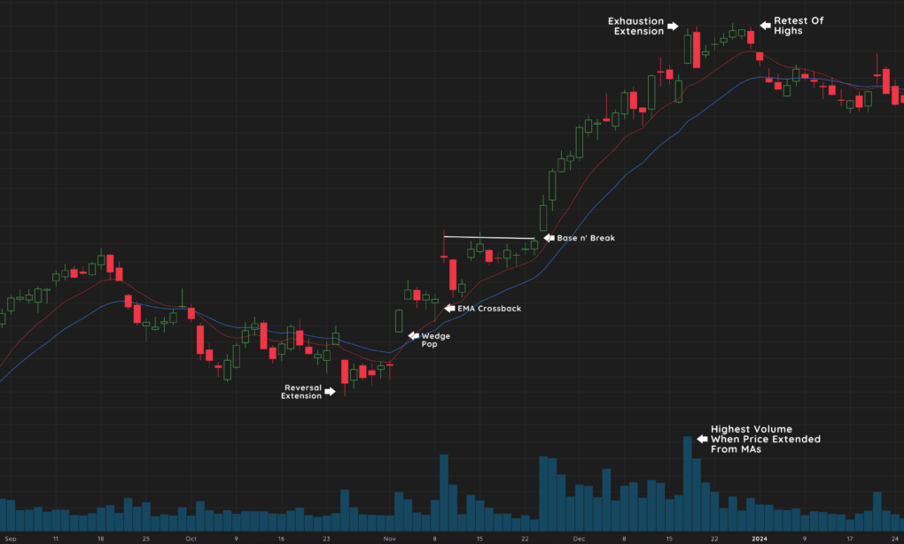  
图 12：AFRM 的 Exhaustion Extension 示例。图表来源：Deepvue。原始图片：[Cycle-Of-Price-Action_6.png](https://traderlionmedia.s3.us-east-2.amazonaws.com/wp-content/uploads/2024/09/11014635/Cycle-Of-Price-Action_6.png)

## 下跌段关键信号

### 6. Wedge Drop：下跌趋势确认

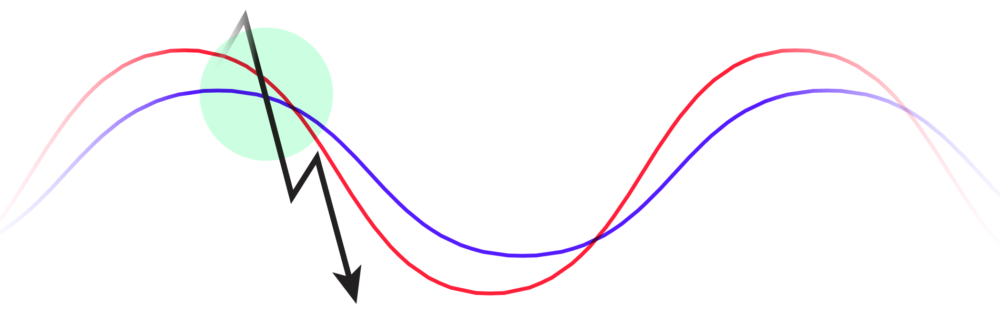  
图 13：Wedge Drop 概念图。原始图片：[VIST-Wedge-Drop-1.png](https://traderlionmedia.s3.us-east-2.amazonaws.com/wp-content/uploads/2024/09/11014656/VIST-Wedge-Drop-1.png)

在 Exhaustion Extension 之后，新增买家减少，价格逐渐贴近移动平均线。当价格带着卖压跌破移动平均线时，Wedge Drop 确认反转。此后价格需要时间消化之前的上涨，或正式进入下跌趋势。

| 示例 | 内容 |
| --- | --- |
| 股票代码 | KBH |
| 公司 | KB Home |
| 年份 | 2023 |

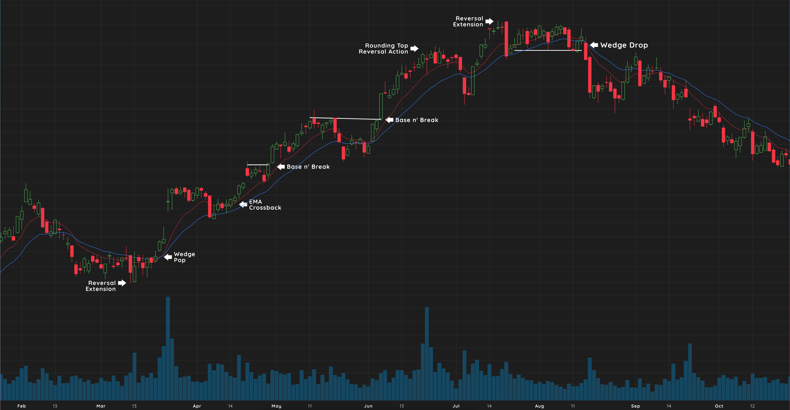  
图 14：KBH 的 Wedge Drop 示例。图表来源：Deepvue。原始图片：[Cycle-Of-Price-Action_7.png](https://traderlionmedia.s3.us-east-2.amazonaws.com/wp-content/uploads/2024/09/11014738/Cycle-Of-Price-Action_7.png)

### 7. EMA Crossback Downside：下跌趋势中的第一次反弹

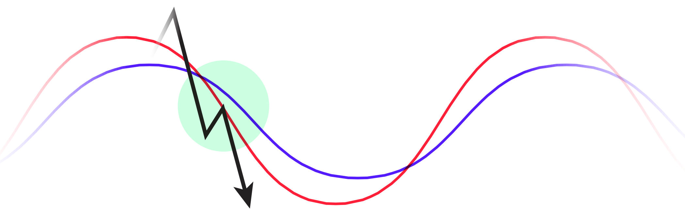  
图 15：EMA Crossback Downside 概念图。原始图片：[VIST-EMA-Crossback-Down.png](https://traderlionmedia.s3.us-east-2.amazonaws.com/wp-content/uploads/2024/09/11014802/VIST-EMA-Crossback-Down.png)

价格失去移动平均线后，第一次反弹往往会回测下行的移动平均线。与上涨阶段的 EMA Crossback 不同，此时移动平均线从支撑变成阻力。反弹遇到卖压后价格继续回落，下跌趋势得以延续。

### 8. Base n' Break Downside：下跌趋势继续延伸

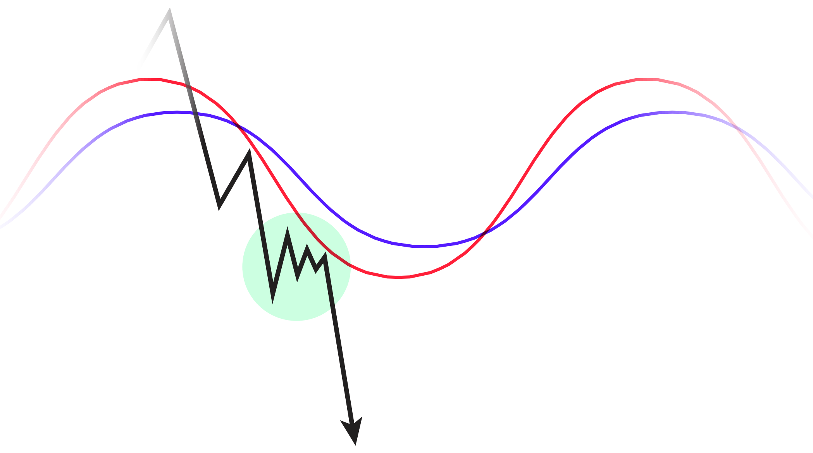  
图 16：Base n' Break Downside 概念图。原始图片：[VIST-Base-n-Break-Down-1.png](https://traderlionmedia.s3.us-east-2.amazonaws.com/wp-content/uploads/2024/09/11014831/VIST-Base-n-Break-Down-1.png)

下跌趋势中也会出现小型横向整理，但这次移动平均线位于价格上方并形成阻力。价格反弹至均线附近后再次走弱，使下跌结构继续向下延伸。最终当新的 Reversal Extension 出现，价格周期重新开始。

| 示例 | 内容 |
| --- | --- |
| 股票代码 | PHM |
| 公司 | Pultegroup |
| 年份 | 2023 |

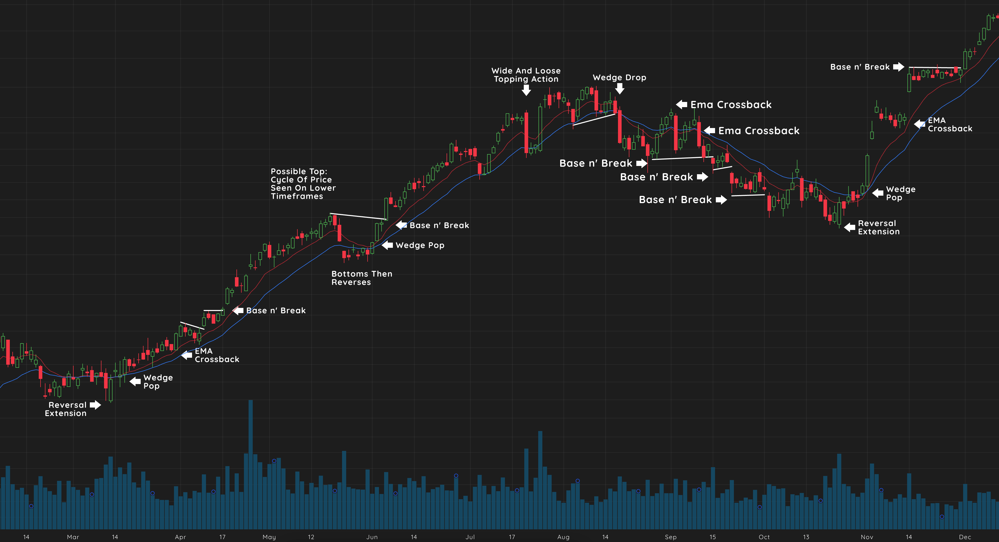  
图 17：PHM 的 Base n' Break Downside 示例。图表来源：Deepvue。原始图片：[Cycle-Of-Price-Action_8.png](https://traderlionmedia.s3.us-east-2.amazonaws.com/wp-content/uploads/2024/09/11014922/Cycle-Of-Price-Action_8.png)

## Oliver Kell 的交易方法

### 价格与成交量优先

Oliver Kell 先寻找基本面变化最强的成长股，尤其是盈利和销售额加速增长的公司。但实际决策仍以价格与成交量为主导。他认为价格行为是最重要的指标，干净的图表有助于减少噪音。

成交量用来确认价格行为，重点观察三类位置：

- 周期初期：确认底部或趋势启动。
- 通过 pivot 时：确认突破有效性。
- 反转时：确认卖压或买压变化。

文章将这一逻辑概括为：**Volume = Price, Cause = Effect。**

### 移动平均线

移动平均线跟随价格，是判断趋势方向的二级工具，而不是决策的第一信号。

| 移动平均线 | 作用 |
| --- | --- |
| 10 日 EMA、20 日 EMA | 观察中期趋势 |
| 50 日 SMA、200 日 SMA | 观察长期趋势 |

### 多时间周期

Kell 使用多个时间周期确认价格行为：

| 时间周期 | 用途 |
| --- | --- |
| 周线 | 观察更大级别的市场结构 |
| 日线 | 管理交易 |
| 小时线、15 分钟线 | 执行入场 |

文章提醒，过度关注低时间周期容易造成过度交易。正确顺序是：先用高时间周期规划交易，再用低时间周期执行交易。

## 整体应用

该策略的第一步是选择有成长性的股票，而不是任意交易图表。之后根据价格周期定位当前阶段：

- 周期早期保持耐心，等待低风险入场点。
- 趋势中期利用 Base n' Break 和 EMA Crossback 管理仓位。
- 趋势后期更快锁定利润，避免价格过度扩张后的回撤。
- 价格见顶并进入下跌段时离场，等待周期重置。

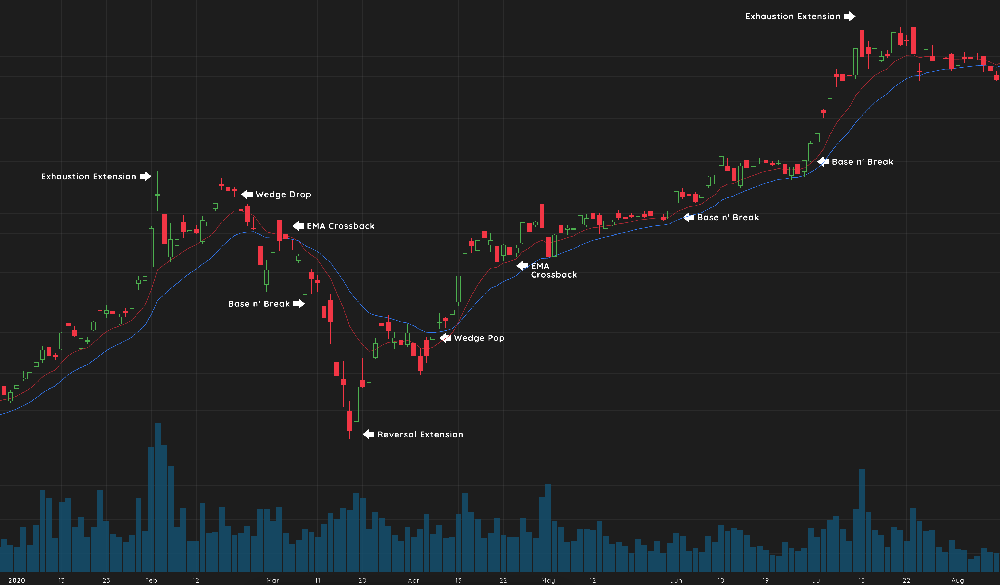  
图 18：TSLA 的完整价格周期示例，年份为 2020。图表来源：Deepvue。原始图片：[Cycle-Of-Price-Action_9.png](https://traderlionmedia.s3.us-east-2.amazonaws.com/wp-content/uploads/2024/09/11014957/Cycle-Of-Price-Action_9.png)

## 原文 FAQ

### What is the Cycle of Price Action in trading?

Cycle of Price Action 是 Oliver Kell 开发的交易框架，通过积累和派发等可重复价格模式识别强势股票和低风险买点。

### How does the Reversal Extension signal a trend change?

Reversal Extension 表示价格因恐惧和抛售而触底，下跌趋势可能结束。交易者会寻找高时间周期上的强支撑，并观察低时间周期价格回弹，通常还需要大量成交量确认。

### What is the "Wedge Pop" in the Cycle of Price Action?

Wedge Pop 是反转后的第一个看涨信号。价格从低点反弹后横向整理，随后突破短期阻力并重新收复移动平均线，形成一个风险可控的入场点。

## 图片索引

| 图号 | 本地文件 | 原始链接 |
| ---: | --- | --- |
| 1 | `images/02-cycle.png` | [Cycle-of-Price-Oliver-Kell.png](https://traderlionmedia.s3.us-east-2.amazonaws.com/wp-content/uploads/2024/09/04133730/Cycle-of-Price-Oliver-Kell.png) |
| 2 | `images/01-feature.png` | [Oliver-Kell-Cycle-of-Price-Action-Feature-1024x576.png](https://traderlionmedia.s3.us-east-2.amazonaws.com/wp-content/uploads/2024/09/04134038/Oliver-Kell-Cycle-of-Price-Action-Feature-1024x576.png) |
| 3 | `images/03-reversal-extension-concept.png` | [VIST-Reversal-Extension-2-1024x512-1-1020x510.png](https://traderlionmedia.s3.us-east-2.amazonaws.com/wp-content/uploads/2024/09/11012052/VIST-Reversal-Extension-2-1024x512-1-1020x510.png) |
| 4 | `images/04-reversal-extension-elf.png` | [Cycle-Of-Price-Action_2.png](https://traderlionmedia.s3.us-east-2.amazonaws.com/wp-content/uploads/2024/09/11013308/Cycle-Of-Price-Action_2.png) |
| 5 | `images/05-wedge-pop-concept.png` | [VIST-Wedge-Pop-1-1020x344.png](https://traderlionmedia.s3.us-east-2.amazonaws.com/wp-content/uploads/2024/09/11013448/VIST-Wedge-Pop-1-1020x344.png) |
| 6 | `images/06-wedge-pop-nvda.png` | [Cycle-Of-Price-Action_3.png](https://traderlionmedia.s3.us-east-2.amazonaws.com/wp-content/uploads/2024/09/11013553/Cycle-Of-Price-Action_3.png) |
| 7 | `images/07-ema-crossback-concept.png` | [VIST-EMA-Crossback-1-1020x340.png](https://traderlionmedia.s3.us-east-2.amazonaws.com/wp-content/uploads/2024/09/11013806/VIST-EMA-Crossback-1-1020x340.png) |
| 8 | `images/08-ema-crossback-tol.png` | [Cycle-Of-Price-Action_4.png](https://traderlionmedia.s3.us-east-2.amazonaws.com/wp-content/uploads/2024/09/11013838/Cycle-Of-Price-Action_4.png) |
| 9 | `images/09-base-n-break-concept.png` | [VIST-Base-n-Break-1-1020x569.png](https://traderlionmedia.s3.us-east-2.amazonaws.com/wp-content/uploads/2024/09/11013902/VIST-Base-n-Break-1-1020x569.png) |
| 10 | `images/10-base-n-break-wing.png` | [Cycle-Of-Price-Action_5-1.png](https://traderlionmedia.s3.us-east-2.amazonaws.com/wp-content/uploads/2024/09/11014041/Cycle-Of-Price-Action_5-1.png) |
| 11 | `images/11-exhaustion-extension-concept.png` | [VIST-Exhaustion-Extension-1-1020x655.png](https://traderlionmedia.s3.us-east-2.amazonaws.com/wp-content/uploads/2024/09/11014600/VIST-Exhaustion-Extension-1-1020x655.png) |
| 12 | `images/12-exhaustion-extension-afrm.png` | [Cycle-Of-Price-Action_6.png](https://traderlionmedia.s3.us-east-2.amazonaws.com/wp-content/uploads/2024/09/11014635/Cycle-Of-Price-Action_6.png) |
| 13 | `images/13-wedge-drop-concept.png` | [VIST-Wedge-Drop-1.png](https://traderlionmedia.s3.us-east-2.amazonaws.com/wp-content/uploads/2024/09/11014656/VIST-Wedge-Drop-1.png) |
| 14 | `images/14-wedge-drop-kbh.png` | [Cycle-Of-Price-Action_7.png](https://traderlionmedia.s3.us-east-2.amazonaws.com/wp-content/uploads/2024/09/11014738/Cycle-Of-Price-Action_7.png) |
| 15 | `images/15-ema-crossback-downside-concept.png` | [VIST-EMA-Crossback-Down.png](https://traderlionmedia.s3.us-east-2.amazonaws.com/wp-content/uploads/2024/09/11014802/VIST-EMA-Crossback-Down.png) |
| 16 | `images/16-base-n-break-downside-concept.png` | [VIST-Base-n-Break-Down-1.png](https://traderlionmedia.s3.us-east-2.amazonaws.com/wp-content/uploads/2024/09/11014831/VIST-Base-n-Break-Down-1.png) |
| 17 | `images/17-base-n-break-downside-phm.png` | [Cycle-Of-Price-Action_8.png](https://traderlionmedia.s3.us-east-2.amazonaws.com/wp-content/uploads/2024/09/11014922/Cycle-Of-Price-Action_8.png) |
| 18 | `images/18-cycle-summary-tsla.png` | [Cycle-Of-Price-Action_9.png](https://traderlionmedia.s3.us-east-2.amazonaws.com/wp-content/uploads/2024/09/11014957/Cycle-Of-Price-Action_9.png) |

## 整理说明

- 原文中的图表由 Deepvue 提供，示例个股仅用于说明价格形态。
- 本文档保留原文的核心结构与关键术语。
- 图片已下载到本地 `images` 文件夹，同时保留原始图片链接，便于追溯。
